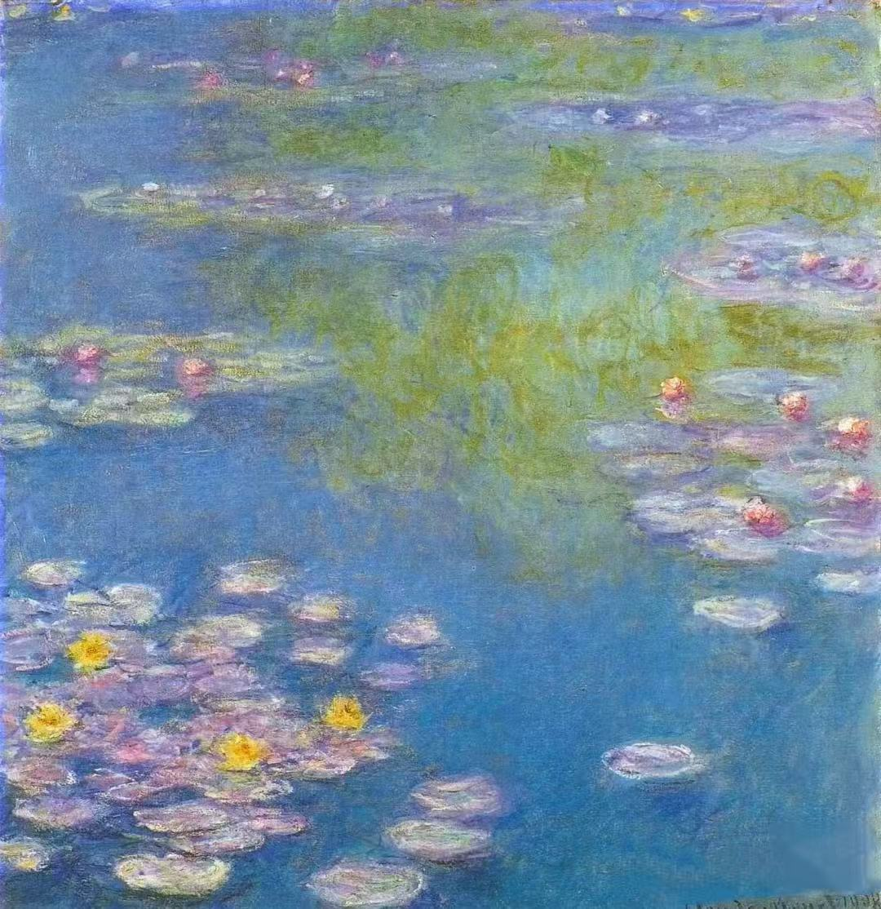
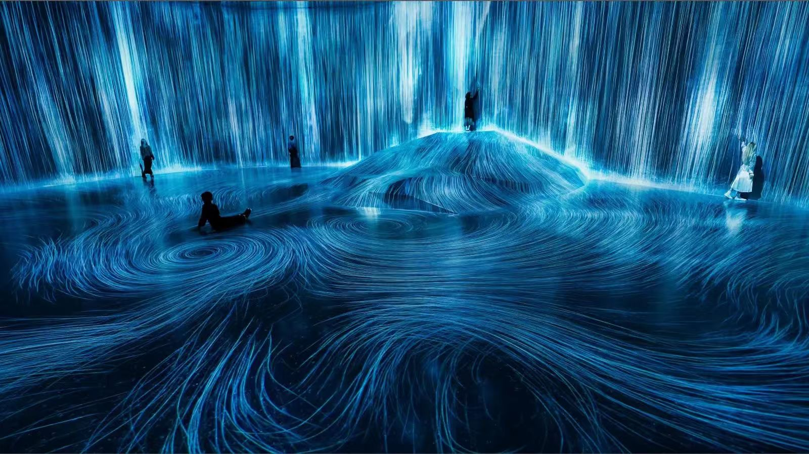
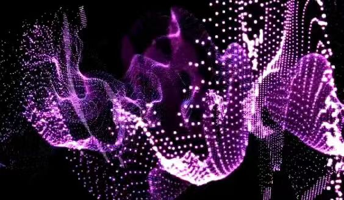
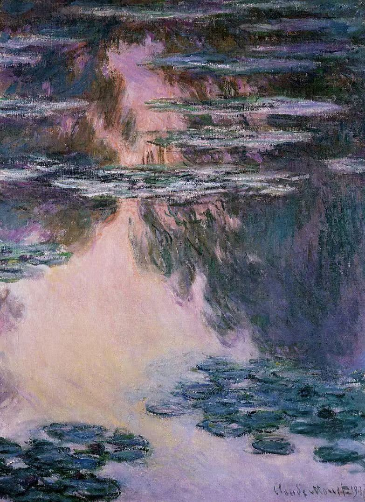
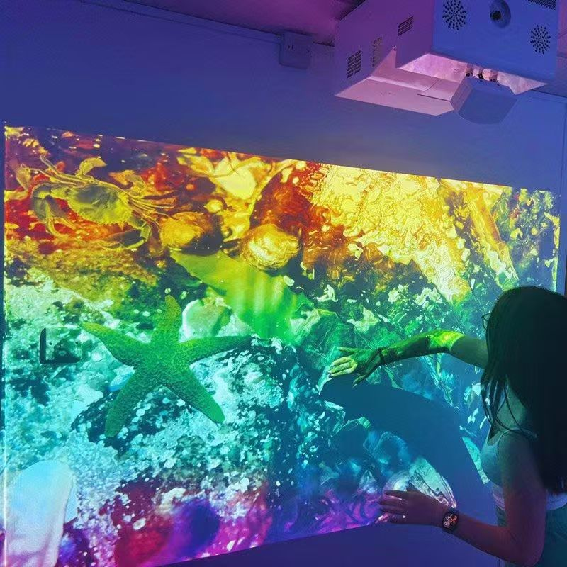

# Quiz 9 – Final Project Pitch

## Project Title  
**Living Water Lilies**

---

## Part 1: Project Direction

Our team has chosen to **reinterpret an existing artwork**.

The artwork we are working from is **Water Lilies by Claude Monet**. Monet’s Water Lilies paintings focus on water, reflection, natural light, and floating flowers. Instead of recreating the painting as a still image, our project will transform it into an interactive digital pond. The pond will respond to sound, time, and user interaction. Sound will influence the movement of the water, time will change the atmosphere from day to night, and user input will create ripples and new lilies. Our inspiration also comes from teamLab’s interactive digital installations, which use light, particles, and movement to create immersive natural environments. We want our project to feel calm, poetic, and alive, while still keeping the soft visual feeling of Monet’s original painting.

### Inspiration Sources

---

## Part 2: Mechanics

### Team Members and Mechanics

| Team Member | Mechanic |
|---|---|
| Rui Li | Audio Reactive Water Surface |
| Manyu Lin | Time-based Day/Night Pond |
| Chenyuan Zhang | Interactive Ripple Garden |

---

## Mechanic 1: Audio Reactive Water Surface  
**Owner: Rui Li**

This mechanic uses sound to control the movement and energy of the water surface. The audio level or frequency content will be analysed using p5.js sound tools, such as amplitude or FFT. When the sound becomes louder, the water will create stronger ripples, brighter reflections, and more visible movement. High-frequency sounds may create small particles or tiny water sparkles, while low-frequency sounds may create larger circular ripples across the pond. This connects to Monet’s Water Lilies because the original painting already focuses on the surface of water and reflected light. Instead of showing a still pond, this mechanic makes the pond feel alive and reactive. The user does not need to directly control this mechanic; the environment or music becomes part of the artwork.

---

## Mechanic 2: Time-based Day/Night Pond  
**Owner: Manyu Lin**

This mechanic uses timers and frame-based events to change the pond over time. The scene will slowly move through different lighting states, such as morning, daytime, sunset, and night. Each time state will have a different colour palette, brightness, and atmosphere. For example, the daytime pond may use blue and green colours, while sunset may use warmer pink and orange tones. At night, the water may become darker and small star-like particles may appear. The lilies can also slowly open and close based on time. This mechanic strongly connects to Monet’s interest in painting the same scene under different light conditions. It also uses timed changes and smooth transitions to create natural animation.

---

## Mechanic 3: Interactive Ripple Garden  
**Owner: Chenyuan Zhang**

This mechanic allows the user to interact directly with the digital pond through mouse and keyboard input. When the user moves the mouse across the canvas, soft ripples will appear on the water surface. When the user clicks, a new lily or flower may grow at that position, and small particles may spread out like water movement. Keyboard input can be used to change the weather or brush effect, such as calm, windy, or glowing mode. This mechanic is important because it allows the audience to feel like they are entering Monet’s painting rather than only looking at it. The interaction should be gentle and poetic, matching the calm feeling of Water Lilies. It will also make the final demo easier to understand and visually engaging.

---

## Part 3: Putting It Together

Together, the three mechanics create a living reinterpretation of Monet’s Water Lilies. Sound shapes the movement of the pond, time transforms the atmosphere, and user interaction generates ripples and growth. All mechanics will share the same canvas and visual system. Rather than becoming three separate mini-games, they will work together as one digital ecosystem. The soft colour palette, water movement, floating lilies, and particle effects will hold the project together visually and conceptually.